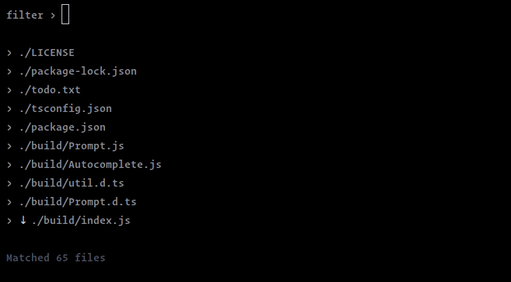

# Customization
The package exports the following items to customize the prompt's default UI and behaviours.

```javascript
export {
  Autocomplete,

  // utilities
  dimUnmatchedStrings,
  getMatchedIndexes,

  // Interface (useful in TypeScript project)
  ListItem,
  AutocompleteOptions,
};
```

## Example
The following example demonstrates how to extend the `Autocomplete` class to implement a
custom autocomplete prompt. See the [jest-style-autocomplete](./examples/jest-style-autocomplete/index.ts)
directory for reference. To learn more about the available fields and methods, see the [API](#api) section.



```typescript
// JestStyleAutocomplete.ts

import { gray, dim, bgYellow } from 'kleur';
import mm from 'micromatch';
import isGlob from 'is-glob';
import {
  Autocomplete,
  ListItem,
  AutocompleteOptions,
  dimUnmatchedStrings,
  getMatchedIndexes,
} from 'cli-autocomplete-prompt';

export class JestStyleAutocomplete extends Autocomplete {
  constructor(options: AutocompleteOptions) {
    super(options);
  }

  suggestion(item: ListItem): boolean {
    if (this.input === '') return true;

    // to support globs as a search input
    return mm.contains(item.label, this.input);
  }

  highlight(input = '', label = ''): string {
    input = input.trim();
    if (input.length === 0) return dim(label);

    // by default, it's a white color text.
    if (isGlob(input)) return label;

    const matchedIndexes = getMatchedIndexes(label, input);
    if (matchedIndexes.length === 0) return dim(label);

    return dimUnmatchedStrings(label, matchedIndexes);
  }

  renderOption(
    { label }: ListItem,
    isFocused: boolean,
    isStart: boolean,
    isEnd: boolean
  ): string {
    const prefix = dim('›');
    const scrollIndicator = isStart ? ' ↑' : isEnd ? ' ↓' : '';
    const content = isFocused
      ? bgYellow().black(label)
      : this.highlight(this.input, label);

    return ` ${prefix}${scrollIndicator} ${content}`;
  }

  formatBody(suggestions: string): string {
    if (this.filteredList.length > this.limit) {
      const matchCountText = `\n\n ${gray(`Matched ${this.filteredList.length} files`)}`;

      return ['\n\n', suggestions, matchCountText].join('');
    }

    return `\n\n${suggestions || ' No matches found'}`;
  }
}
```

#### Usage

```typescript
// index.ts

import { basename } from 'path';

import { dim } from 'kleur';
import { ListItem, AutocompleteOptions } from 'cli-autocomplete-prompt';

import { JestStyleAutocomplete } from './JestStyleAutocomplete';

const list = [
  { label: 'lib/cli/index.js', value: 'lib/cli/index.js' },
  { label: 'lib/cli/print.js', value: 'lib/cli/print.js' },
  { label: 'lib/mocha/run.js', value: 'lib/mocha/run.js' },
  { label: '.eslintrc.js', value: '.eslintrc.js' },
  { ... }
];

const options = {
  list,
  // Extract the basename from absolute path
  onSubmit: (matches: ListItem[]) => matches.map(match => basename(match.value)),
  promptLabel: dim(' filter › '),
};

function jestStyleAutocomplete(options: AutocompleteOptions): Promise<void> {
  return new Promise(resolve => {
    const autocomplete = new JestStyleAutocomplete(options);
    autocomplete.on('submit', resolve);
  });
}

(async () => {
  const results = await jestStyleAutocomplete(options);
  console.log(results);
})();
```

## API

### Interface
```typescript
export interface ListItem {
  label: string;
  value: unknown;
}

export interface AutocompleteOptions {
  list?: ListItem[];
  limit?: number;
  onSubmit?: (matches: ListItem[]) => unknown;
  promptLabel?: string;
}
```

### `Autocomplete(options: AutocompleteOptions = {})`
Class that extends Node.js `EventEmitter`. It takes an [options](./README.md#options)
(optional) object and emits a `submit` event with the matched items as a payload when the prompt is submitted.

> Listed only much-needed fields and methods to extend the default functionality. See the [implementation](./src/Autocomplete.ts) for the complete reference.

### Fields
| Name&nbsp;&nbsp;&nbsp;&nbsp;&nbsp;&nbsp; | Type&nbsp;&nbsp;&nbsp;&nbsp;&nbsp;&nbsp; | Default&nbsp;&nbsp;&nbsp;&nbsp;&nbsp;&nbsp; | Description |
| :--- | :--- | :--- | :--- |
| input | `string` | `''` | Current user input |
| focusedItemIndex | `number` \| `null` | `null` | Current focused item index |
| filteredList | `ListItem[]` | `[]` | Filtered list items based on the user input. |

### Methods

#### `suggestion(item: ListItem): boolean;`
Used to filter list items. The method gets called for each list item.
<br><br>

#### `highlight(input = '', label = ''): string;`
Used to format the list item's **label**. Useful to highlight the matched characters based on the user input.
The method gets called for each list item. It receives the current user input and the list item's label as arguments.
<br><br>

#### `renderOption(item: ListItem, isFocused: boolean, isStart: boolean, isEnd: boolean): string;`
Used to format the list item. The method gets called for each list item.
Useful to show navigation indicators, highlight the item based on the current focus state.
<br><br>

#### `formatBody(suggestions: string): string;`
Used to format the body section of the prompt before it gets rendered. Useful to provide fallback content or extend
the body to add new content. (E.g. Footer section).
