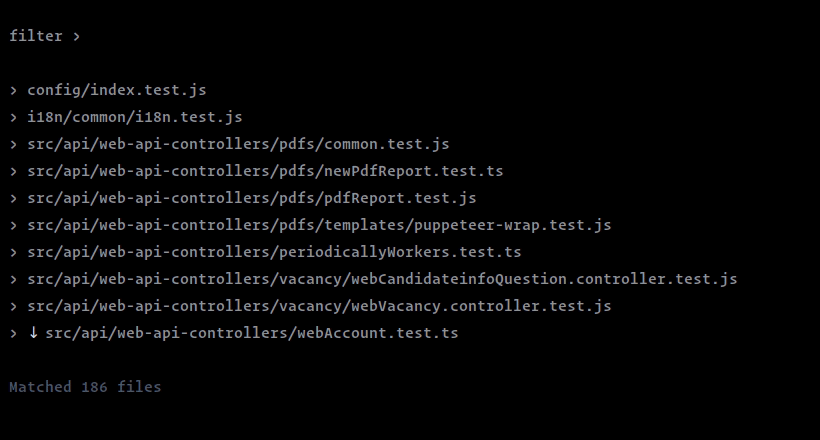
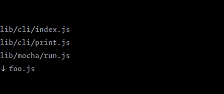

# cli-autocomplete-prompt
A primitive autocomplete prompt that provides full control over its UI.



## Motivation
In one of my [projects](https://github.com/m-sureshraj/mocha-watch-typeahead), I was trying to create a [jest-watch-typeahead](https://github.com/jest-community/jest-watch-typeahead#jest-watch-typeahead)
style autocomplete prompt. My initial attempt was to find a library
to implement it. So my search began, and I found several nice CLI
prompt libraries. Most of them offered UI, behavior customization to
some extent. However, those customizations were not enough to build
the needed prompt. Therefore, I created this autocomplete prompt that
extendable to control its UI and behaviors.

## Install
```
npm install --save cli-autocomplete-prompt
```
> This package supports Node.js version 8.6 and above

## Usage
The autocomplete prompt can be created using the `autoComplete`
factory function. See the [default-autocomplete](./examples/default-autocomplete/index.ts) directory for reference.

```javascript
const { autoComplete } = require('cli-autocomplete-prompt');

const list = [
  { label: 'lib/cli/index.js', value: 'lib/cli/index.js' },
  { label: 'lib/cli/print.js', value: 'lib/cli/print.js' },
  { label: 'lib/mocha/run.js', value: 'lib/mocha/run.js' },
  { ... },
];

(async () => {
    const options = { list };
    const results = await autoComplete(options);

    console.log(results);
})();
```

Use `↑ up` / `↓ down` arrow keys to navigate. Use `↵ enter` key to
get the matched item[s].



The autocomplete prompt's default behaviors:

* If the input is empty, it matches all items when the prompt is submitted.
* The suggestion logic uses the `String.includes` method on items'
  label property to update the list while the user types.
* It prevents prompt submission when there is no match found.

## API

### autoComplete(options?)
Type: `Function` <br>
Returns: `Promise`

It takes an [options](#options) (optional) object and returns the
matched items when the prompt is submitted.

### Options
| Property | Type | Default | Description |
| --- | --- | --- | --- |
| promptLabel | `string` | `''` | Prompt label to display |
| limit | `number` | 10 | Max number of results to show |
| list | `array` | `[]` | An array of list items. A list item should be an object with the `label`, `value` property. The label should be a type `string`, and the value can be anything. |
| onSubmit | `function` | `undefined` | A hook to transform the matched items before they get submitted. It receives the matched items (`array`) as an argument. |

## Customization
In addition to the factory function, the package exports a `class` and
a couple of utility functions to customize the prompt's default UI and behaviors.
View [CUSTOMIZATION.md](./CUSTOMIZATION.md) to learn more about the customization.

## Credits
[Prompts](https://github.com/terkelg/prompts) - is a lightweight library to create beautiful and user-friendly interactive prompts.
Some ideas have been taken from this project to build the autocomplete prompt.

## License
MIT License © [Sureshraj](https://github.com/m-sureshraj)
